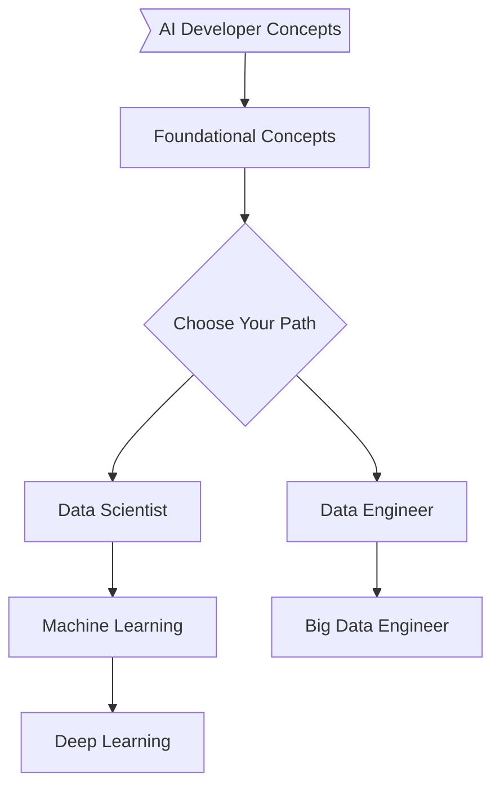
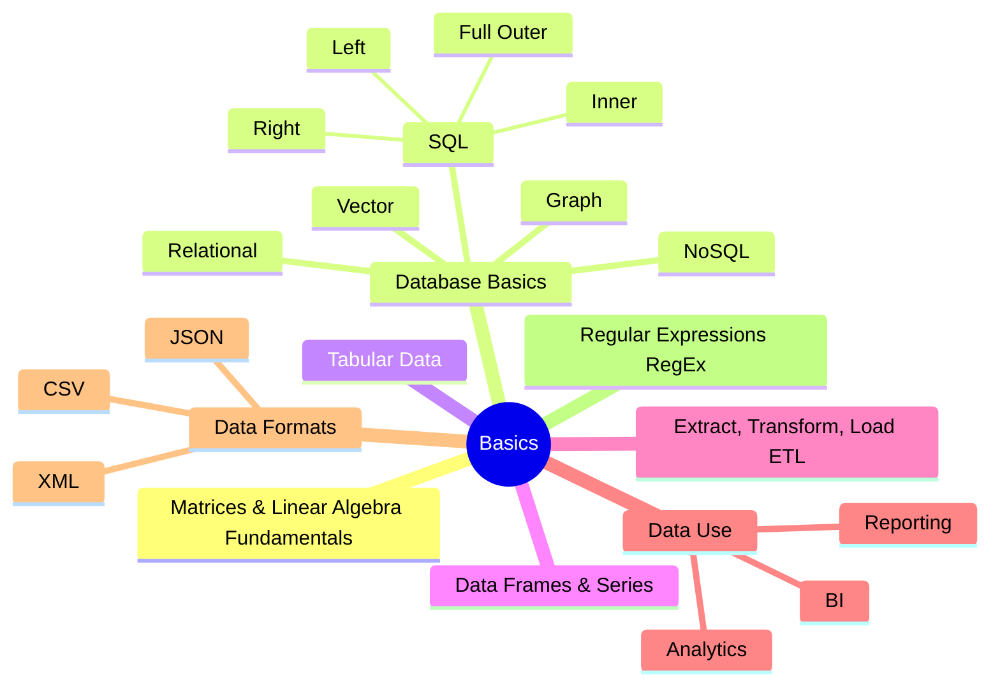

  
  <h2 align="center">AI Expert Roadmap with Connections</h2>
  
Roadmap to a Solid Foundation in Artificial Intelligence

  

      
      
      

  

   

This is a fork and adaptation of https://github.com/AMAI-GmbH/AI-Expert-Roadmap

I've ported over the flowcharts to use the [Mermaid library](https://mermaid.js.org), that is intragrated into GitHub

If you are interested collaborating, drop a note to [jmhead@jasonmhead.com](mailto:jmhead@jasonmhead.com).

## Note

👉 An **interactive version with links to follow** about each bullet of the list can be found at (https://jasonmhead.com/ai-expert-roadmap-with-connections/) 👈

To receive updates [star :star:] and watch :eyes: the [GitHub Repo](https://github.com/jasonmhead/AI-Expert-Roadmap-Connections) to get notified, when we add new content to stay on the top of the most recent research.

Subscribe to a [AI Newsletter](https://jasonmhead.com) to get links to developments in AI or Robotics that are interesting / useful. 

## Introduction

## Fundamentals

Relational vs. non-relational databases 
SQL + Joins (Inner. Outer. Cross. Theta Jd 
NoSOL 

  

## Data Science Roadmap

  

## Machine Learning Roadmap

  

## Deep Learning Roadmap

  

## Data Engineer Roadmap

  

## Big Data Engineer Roadmap

  

## 🚦 Wrap Up

If you think any of the roadmaps can be improved, please do open a PR with any updates and submit any issues. 

